<h3><code>bilgehan@github ~ $ ./contributions.sh</code></h3>

  

<h3><code>bilgehan@github ~ $ whoami</code></h3>
<table>
  <tr>
    <td valign="top"></td>
    <td valign="top"></td>
  </tr>
</table>

 

### 🧑‍💻 Hakkımda

- 🎓 Gazi Üniversitesi Bilgisayar Mühendisliği, 3. sınıf öğrencisi (Ort: 3.30/4.00)
- 🛡️ Akbank Siber Güvenlik Analistliği eğitim programını tamamladım — CyberOps Associate & CCNA sertifikalı
- 🤝 **Gazi Üniversitesi Yapay Zekâ Topluluğu**'nda Başkan Yardımcısı (önceden İletişim Komitesi Başkanı & Sorumlusu)
- 🔌 ESP32 tabanlı gömülü sistem ve ağ güvenliği projeleri geliştiriyorum
- 🤖 Yapay zekâ ve görüntü işleme üzerine küçük projeler üretiyorum
- ✈️ Hedefim: staj/öğrenim hareketliliği ile Avrupa'da uluslararası deneyim kazanmak
- 📫 **bilgehanakbas0@gmail.com**

---

### 🚀 Projeler

| Proje | Açıklama |
|---|---|
| [**Smart Library Smart-Seat**](https://bilgehanakbas.github.io/smart-seat.html) | YOLOv8 & OpenCV ile kütüphane doluluk oranlarını otomatik takip eden yapay zekâ sistemi |
| [**ToDo Project**](https://bilgehanakbas.github.io/todo-project.html) | Java Spring Boot ile geliştirilmiş görev/not yönetimi web uygulaması |
| [**Mobius Chess**](https://bilgehanakbas.github.io/mobius-chess.html) *(geliştiriliyor)* | Three.js/WebGL ile non-Euclidean topolojili satranç varyantı |
| [**ESP32 Akıllı Sensör**](https://bilgehanakbas.github.io/esp32.html) *(geliştiriliyor)* | ESP32-WROOM-32U ve harici anten ile uçtan uca ağ entegrasyon projesi |

---

### 🏆 Sertifikalar

`CyberOps Associate` `CCNA: Introduction to Networks` `Introduction to Cybersecurity` `Linux Unhatched` — Cisco
`Python Programlama` `Makine Öğrenmesi` `Python ile ML Uygulamaları` `Derin Öğrenmeye Giriş` `Siber Güvenliğe Giriş` — BTK Akademi
`Data Science 101` — Techcareer.net Bootcamp Fest'4

---

### 🛠️ Yetenekler & Teknolojiler

